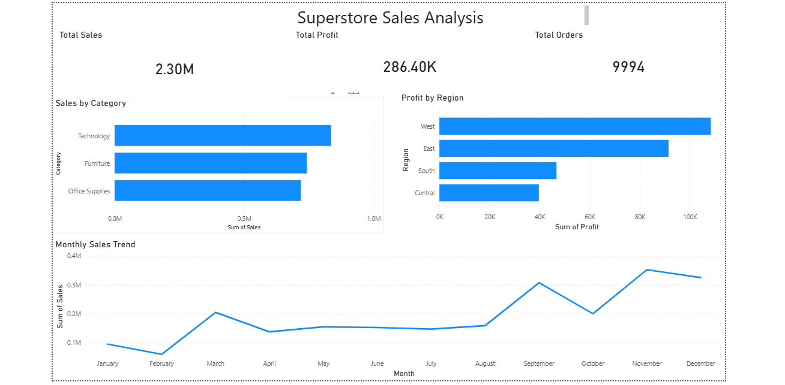

# Superstore Sales Analysis
**Tools:** SQL (SQLite) · Power BI · DB Browser for SQLite

## Project Overview
Analyzed a 10,000-row retail dataset to identify profitability issues across product categories, 
sub-categories, and regions. The goal was to surface actionable business insights from raw 
transactional data and present findings in a clear, non-technical dashboard.

## Business Questions Explored
- Which product categories generate the most revenue vs. the most profit?
- Are discounts hurting profitability in specific categories?
- Which sub-categories are actively losing money despite strong sales?
- Which regions are underperforming relative to their order volume?

## Key Findings
- **Technology** leads in both sales ($836K) and profit margin (17%), making it the 
  strongest performing category
- **Furniture** generates $742K in sales but holds only a 2.49% profit margin — 
  the lowest of all categories
- **Tables and Bookcases** are losing money outright: Tables at -$17.7K profit 
  and Bookcases at -$3.5K, both driven by discount rates above 21%
- **Central region** processes the second highest order volume (1,175 orders) but 
  generates the lowest profit margin at 7.92% — nearly half the West region's 14.94%

## Business Recommendation
The data points to a company-wide discounting problem. Aggressive discounts across 
Furniture sub-categories and the Central region are eroding profitability despite 
strong revenue numbers. A discount strategy review on Tables, Bookcases, and 
Central region accounts could significantly improve overall margins.

## Dashboard

## SQL Queries
See [`queries.sql`](queries.sql) for all analysis queries used in this project.

## Files
| File | Description |
|------|-------------|
| `queries.sql` | All SQL queries used for analysis |
| `dashboard.png` | Power BI dashboard screenshot |
